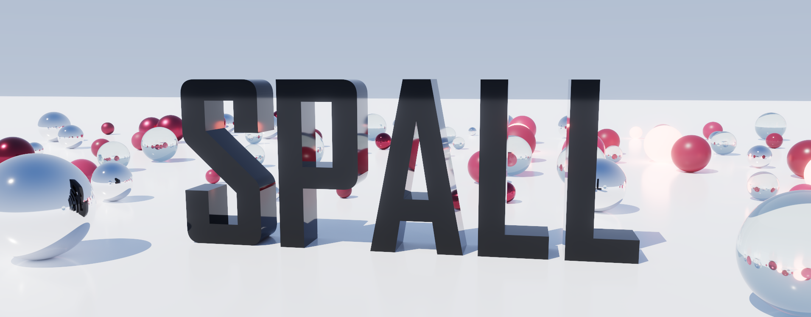

<p align="center">
  
</p>

<p align="center">
  <b>A C++20 rendering hardware interface for Direct3D 12 and Vulkan 1.2.</b>
</p>

<p align="center">
  
</p>

Spall provides one API over different GAPIs. Devices, queues, frames and swap chains stay where you put them, and the backend is picked at run time from whichever backends were built. Presentation currently requires Win32.

## Build

Requirements: CMake 4.2+, a C++20 compiler, and vcpkg with `VCPKG_ROOT` set. The Vulkan backend also requires a Vulkan SDK.

```sh
cmake --preset ninja-debug
cmake --build --preset ninja-debug
ctest --preset ninja-debug
```

Use `ninja-release` for a release build.

At least one backend must be enabled. Relevant configure options are:

```text
SPALL_ENABLE_D3D12
SPALL_ENABLE_VULKAN
SPALL_BUILD_EXAMPLES
SPALL_BUILD_TESTS
```

## CMake

Installed package:

```cmake
find_package(spall CONFIG REQUIRED)
target_link_libraries(app PRIVATE spall::backends)
```

In-tree dependency:

```cmake
add_subdirectory(path/to/spall)
target_link_libraries(app PRIVATE spall::backends)
```

Link the highest layer used by the application:

- `spall::spall`: backend-independent API
- `spall::d3d12` or `spall::vulkan`: specific backend
- `spall::backends`: backend factory

## Examples

- [`examples/spinning_cube`](examples/spinning_cube): render pass, vertex input and push constants on D3D12
- [`examples/compute_image`](examples/compute_image): compute dispatch into a storage texture, sampled for display, on Vulkan

## License

[Apache-2.0](LICENSE)
